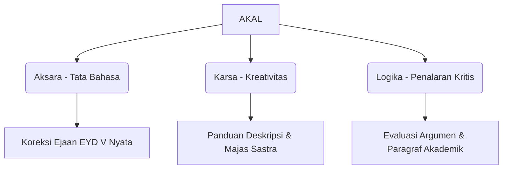

# AKAL — Aksara | Karsa | Logika
> **Platform Latihan Menulis Akademik & Kreatif Berbasis AI & Analisis Performa Mengetik untuk Pelajar Indonesia.**

[](https://react.dev/)
[](https://vite.dev/)
[](https://tailwindcss.com/)
[](https://bun.sh/)
[](https://cerebras.ai/)

---

## Tentang AKAL

**AKAL** adalah sebuah platform web interaktif yang dirancang sebagai sarana latihan menulis mandiri bagi pelajar Indonesia. Dengan mengintegrasikan kekuatan **Kecerdasan Buatan (LLM)** dan **Mesin Evaluasi Lokal**, AKAL membantu mengasah kompetensi berbahasa, struktur berpikir kritis, dan kelancaran motorik menulis (mengetik) dalam satu ekosistem terpadu.

Nama **AKAL** merepresentasikan tiga pilar kompetensi yang dibangun secara sinergis:



---

## Fitur Utama & Cara Kerja Sistem

Aplikasi ini dilengkapi dengan fitur cerdas yang dirancang khusus untuk memandu pelajar langkah demi langkah:

### 1. Jalur Pembelajaran & Umpan Balik AI (Writing Tracks)
*   **Menulis Akademis (Logika):** Melatih penalaran objektif dan struktur argumen (kalimat utama, penjelas, dan simpulan) dengan skala penilaian baku $1 - 4$ per kriteria.
*   **Menulis Kreatif (Karsa):** Melatih imajinasi naratif, kedalaman sensori (panca indra), keunikan ekspresi, serta ketepatan penggunaan majas/figur bahasa.
*   **Koreksi Ejaan Real-Time (Aksara):** Fitur layaknya *Grammarly* versi Indonesia. Secara instan menandai (*inline highlighting*) kata typo, bahasa slang informal, atau preposisi keliru, serta memberikan saran koreksi saat kursor diarahkan ke kata tersebut.

> **Arsitektur Prompt Engineering & Few-Shot Learning:**
> Umpan balik AI digerakkan oleh instruksi sistem yang dirancang ketat:
> *   **Generator Topik:** Dipaksa menggunakan parameter instruksi khusus untuk menghasilkan topik bermutu yang menantang pemikiran kritis siswa (menghindari instruksi klise).
> *   **Evaluator AI:** Dilengkapi dengan pedoman baku (EYD V) dan **Few-Shot Examples** terstruktur. AI membedah tulisan per kriteria untuk menghasilkan format penilaian yang diparsing dinamis oleh frontend.

### 2. Tes Menulis Cepat (Dynamic Typing Test)
Melatih ketangkasan motorik jari dan kecepatan berpikir spontan. Teks target di-generate secara dinamis oleh AI untuk mencegah pengguna menghafal teks latihan.

**Metrik & Rumus Perhitungan Performa:**
Aplikasi menggunakan standar kalkulasi pengetikan profesional:
*   **WPM (Words Per Minute):** 
    $$\text{WPM} = \frac{\text{Total Karakter terketik} / 5}{\text{Waktu Berlalu (Menit)}}$$
    *(1 kata direpresentasikan oleh rata-rata 5 karakter termasuk spasi)*
*   **CPM (Characters Per Minute):** 
    $$\text{CPM} = \frac{\text{Total Karakter terketik}}{\text{Waktu Berlalu (Menit)}}$$
*   **Akurasi:** 
    $$\text{Akurasi (\%)} = \left(\frac{\text{Karakter Benar}}{\text{Total Karakter Terketik}}\right) \times 100$$
*   **Konsistensi (Deviasi Ritme):** Mengambil sampel kecepatan WPM setiap 5 detik, kemudian mengukur kestabilannya menggunakan rumus **Standar Deviasi**:
    $$\sigma = \sqrt{\frac{\sum (x_i - \mu)^2}{N}}$$
    *(Semakin kecil nilai deviasi $\sigma$, menunjukkan ritme mengetik Anda semakin stabil dan konsisten)*

### 3. Dasbor Nilai & Lencana Gamifikasi (Achievements)
*   **Sistem Lencana Otomatis:** Memberikan lencana kemajuan secara dinamis (seperti *Langkah Pertama*, *Konsisten*, *Si Kilat*, *Penembak Jitu*, dan *Pujangga*) berdasarkan data evaluasi yang tersimpan di `localStorage`.
*   **Visualisasi Progresif:** Perkembangan kecepatan WPM dan rata-rata skor kriteria divisualisasikan dalam bentuk grafik garis (*line & bar charts*) interaktif menggunakan `recharts`.

---

## Panduan Instalasi & Setup Lokal

Aplikasi ini menggunakan **Vite** sebagai bundler dan **Bun** sebagai runtime utama untuk kecepatan build dan manajemen dependensi yang optimal.

### Prasyarat
*   **Bun** (Sangat Direkomendasikan untuk Performa Optimal) atau **Node.js** versi 18 ke atas.
*   Kunci API (API Key) dari Cerebras Cloud.

### Langkah Setup

1.  **Clone Repositori**
    ```bash
    git clone https://github.com/rwbu69/akal-aksara-karsa-logika.git
    cd akal-aksara-karsa-logika
    ```

2.  **Instalasi Dependensi**
    Menggunakan **Bun** (Direkomendasikan):
    ```bash
    bun install
    ```
    Menggunakan **npm**:
    ```bash
    npm install
    ```

3.  **Konfigurasi Environment Variable**
    Buat file `.env` di direktori utama (*root*) proyek Anda, kemudian tempelkan kunci API Anda:
    ```env
    VITE_CEREBRAS_API_KEY=csk-masukkan_kunci_api_cerebras_anda
    ```

4.  **Jalankan Server Pengembangan**
    Menggunakan **Bun**:
    ```bash
    bun run dev
    ```
    Menggunakan **npm**:
    ```bash
    npm run dev
    ```
    Arahkan browser Anda ke alamat lokal: [http://localhost:5173](http://localhost:5173)

---

## Cara Mendapatkan API Key & Referensi Model

AKAL memanfaatkan model kecerdasan buatan dari ekosistem **gpt-oss-120b** yang disajikan melalui infrastruktur latensi rendah dari Cerebras AI.

1.  Buka halaman resmi Cerebras Cloud di [cloud.cerebras.ai](https://cloud.cerebras.ai).
2.  Daftar akun gratis, lalu masuk ke dasbor developer.
3.  Arahkan ke bagian **"API Keys"** dan buat kunci rahasia baru.
4.  Salin kunci tersebut dan masukkan ke dalam file `.env` proyek Anda, atau Anda juga dapat memasukkannya langsung melalui kolom **"Gunakan API Key Sendiri"** di halaman awal aplikasi (Splash Page) untuk kemudahan integrasi.

**Referensi Model & API Resmi:**
*   Untuk spesifikasi dan dokumentasi teknis model LLM yang digunakan, silakan merujuk ke: [OpenAI API Docs - gpt-oss-120b Model](https://developers.openai.com/api/docs/models/gpt-oss-120b).

---

## Konfigurasi CORS & Bypass Proxy

Ketika aplikasi React client-side mengirimkan request ke endpoint Cerebras, browser secara default akan memblokir request karena aturan keamanan **CORS**. Untuk mengatasi hal ini secara elegan tanpa membutuhkan backend terpisah, kami memanfaatkan konfigurasi **Vite Reverse Proxy** di dalam `vite.config.js`:

```javascript
server: {
  proxy: {
    '/cerebras': {
      target: 'https://api.cerebras.ai',
      changeOrigin: true,
      rewrite: (path) => path.replace(/^\/cerebras/, '')
    }
  }
}
```
Setiap request yang diarahkan ke `/cerebras` secara otomatis diteruskan oleh server lokal Vite ke server API Cerebras asli, menjaga rahasia request dan menghindari kendala browser CORS secara sempurna.

---

## Kesiapan Kompetisi (Audit & Quality Assurance)
Aplikasi ini telah melalui pengujian kualitas kode (*Code Quality & Optimization Audit*) dengan hasil:
*   **0 ESLint Errors:** Bebas dari ancaman *cascading renders* dan mematuhi standar React Hooks secara ketat.
*   **Optimasi Render Modern:** Semua penarik data dibungkus dengan `useCallback` guna efisiensi memori yang optimal.
*   **Sistem Evaluasi Lokal (Dual-Engine):** Jika kuota request API AI Anda habis (*rate-limit 429*) atau koneksi internet terputus, sistem akan otomatis beralih ke **Mesin Evaluasi Cadangan Lokal** berbasis aturan tata bahasa EYD V, memastikan fungsionalitas aplikasi tetap berjalan 100% di hadapan para juri dalam situasi apa pun.
